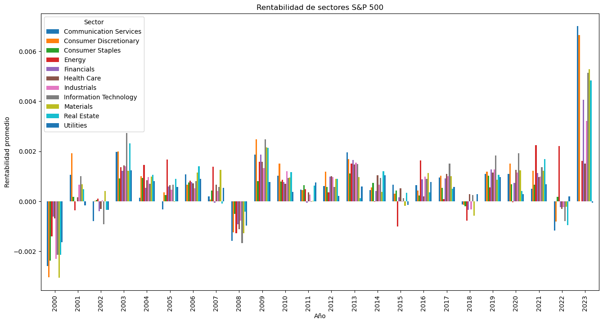
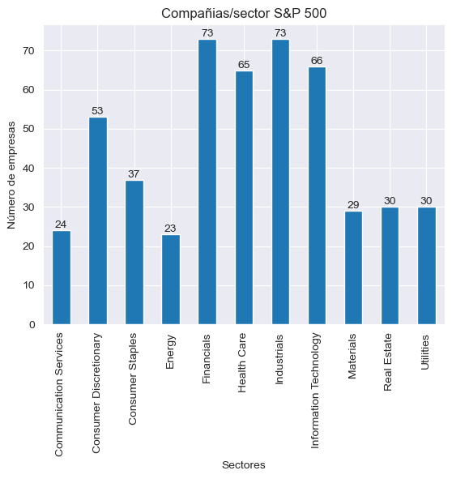
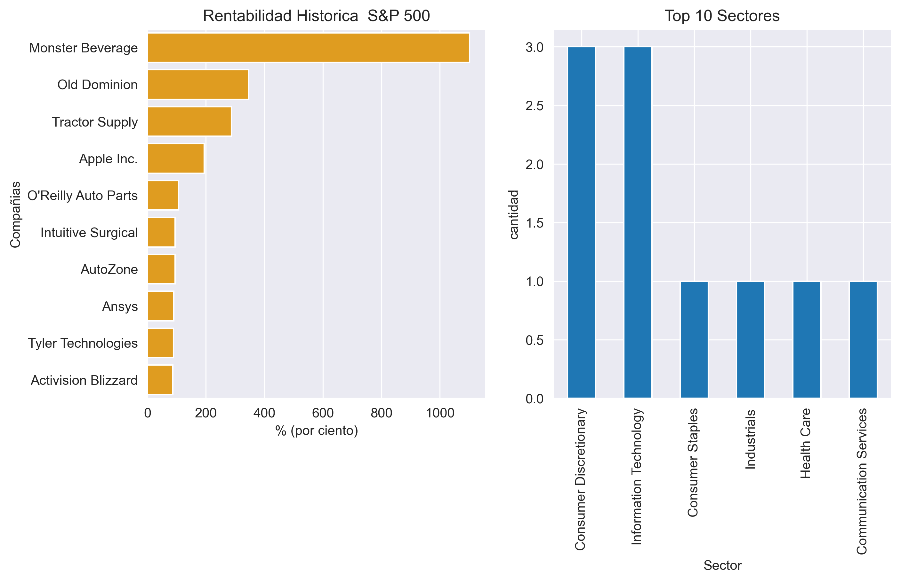
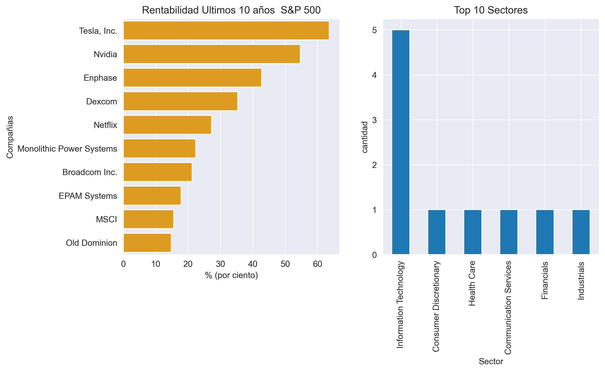
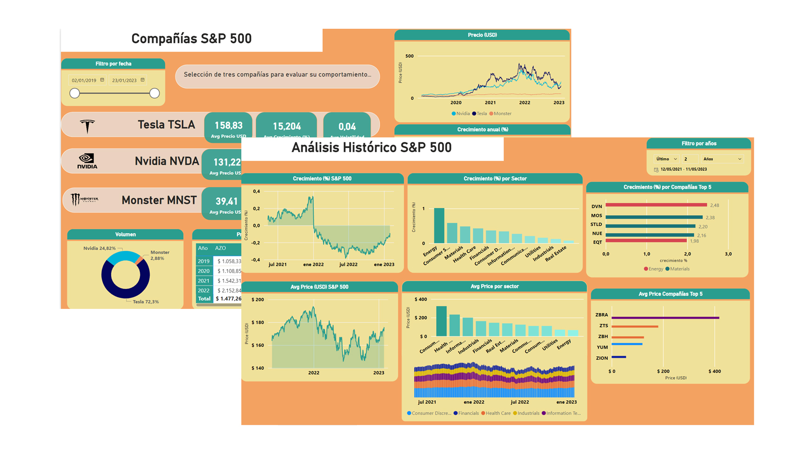

# <h1> Pj_05-002 Análisis de Mercado Bursátil a compañías pertenecientes al índice SP500 [(Standard & Poor's 500 Index)](https://www.spglobal.com/spdji/en/indices/equity/sp-500/#overview) </h1> 

*El presente proyecto se desarrolla para dar cumplimiento a las actividades planteadas en la etapa de labs en el Bootcamp de Data Science de [Soy Henry](https://www.soyhenry.com/). Busca analizar la situación del mercado bursátil de los últimos 20 años y seleccionar compañías potenciales que puedan generar rendimientos de activos financieros al momento de llevar a cabo una inversión en el S&P 500.*

## 1. Introducción

Se analizan los datos de las compañías presentes en el índice SP500 [(Standard & Poor's 500 Index)](https://www.spglobal.com/spdji/en/indices/equity/sp-500/#overview) en [Yahoo Finance](https://finance.yahoo.com/) e [Investing.com](https://www.investing.com/) para mediante el histórico de sus métricas durante los últimos 23 años en el mercado, establecer la selección de tres alternativas prometedoras que puedan tener panoramas favorables al momento de realizar una futura inversión. Se desarrolla un Dashboard en PowerBi que compara los aspectos más relevantes de las compañías seleccionadas.

## 2. Objetivos
- Analizarlas compañias del S&P 500 y seleccionar tres organizaciones.
- Generar tres KPIs a las compañias seleccionadas.
- Desarrollar un Dashboard para la visualización de los datos, métricas e indicadores. 

## 3. Recursos implementados

Python Versión: 3.9 
Packages:  Pandas, Matplotlib, Seaborn 
Yahoo Finance API 
Microsoft PowerBi 

## 4. Desarrollo

### 4.1 ETL Limpieza de datos

El proceso de ETL se realiza con la ingesta de datos desde el origen:  

**Lista compañías S&P 500:** *(data extraída de website)*[ Wikipedia](https://en.wikipedia.org/wiki/List_of_S%26P_500_companies). 
**Historial de precio de acciones compañías S&P 500:** *(data extraída )* [Yahoo Finance](https://finance.yahoo.com/) e [Investing.com](https://www.investing.com/) . 

- Se cargan los datos para su normalización (Tratamiento de nulos, valores duplicados, formateo de variables, entre otros..). 
- Se crean dos datasets para realizar el EDA: ( [**df.csv** ](https://github.com/jospinoponce/AnalisisDeMercadoSP500/blob/main/datasets/df.csv) tiene los datos de todas las empresas del S&P 500 agrupado por año y precio final ajustado de la acción. ) & ([**df_day.csv** ](https://github.com/jospinoponce/AnalisisDeMercadoSP500/blob/main/datasets/df_day.csv): almacena también los datos de las compañías pero las agrupa por día.) 

*Los procesos realizados para el ETL están en el notebook:* [**1.ETL**](https://github.com/jospinoponce/AnalisisDeMercadoSP500/blob/main/Notebooks/1.ETL_report.ipynb)

### 4.2 Análisis Exploratorio de datos EDA

Se analiza  la rentabilidad promedio durante los últimos 23 años.

Se determina que:

*De la lista de las compañías que integran el Index S&P 500 la mayoría hace parte de los sectores: Financials, Health, Industrials e Information Technology.*

*El mejor día para invertir es el martes. Ya Todos las compañías obtienen su precio máximo en sus acciones.*

| sector                 | lunes       | martes      | miércoles   | jueves      | viernes     |
|------------------------|-------------|-------------|-------------|-------------|-------------|
| Communication Services | 50.743.653  | 50.953.955  | 50.775.517  | 50.891.826  | 50.717.519  |
| Consumer Discretionary | 112.008.030 | 113.043.683 | 112.475.725 | 112.672.223 | 112.471.914 |
| Consumer Staples       | 45.900.629  | 46.210.353  | 46.029.720  | 46.086.388  | 46.036.795  |
| Energy                 | 38.811.262  | 39.103.320  | 39.000.121  | 39.021.472  | 39.073.267  |
| Financials             | 64.020.121  | 64.397.962  | 64.196.532  | 64.311.795  | 64.271.107  |
| Health Care            | 78.292.516  | 78.917.763  | 78.602.415  | 78.774.725  | 78.617.358  |
| Industrials            | 61.508.708  | 62.000.621  | 61.720.063  | 61.813.335  | 61.791.934  |
| Information Technology | 65.670.018  | 66.293.690  | 66.022.388  | 66.109.117  | 65.888.221  |
| Materials              | 49.766.189  | 50.151.800  | 49.983.026  | 50.039.106  | 49.990.278  |
| Real Estate            | 54.216.922  | 54.590.200  | 54.387.079  | 54.495.595  | 54.431.062  |
| Utilities              | 32.924.438  | 33.082.243  | 32.957.448  | 33.017.234  | 33.028.672  |

*La compañía que históricamente han tenido una rentabilidad considerable es Monster Beverage con más un 1000%, es decir: ha logrado multiplicar X10 el valor inicial de la empresa.*

*Durante los últimos 10 años el sector energético y tecnológico son los que mas rentabilidades generan.*

*Los procesos realizados para el EDA están en el notebook:* [**2.EDA**](https://github.com/jospinoponce/AnalisisDeMercadoSP500/blob/main/Notebooks/2.EDA_report.ipynb)

## 5. Resultados

### 5.1 Dashboard

Se seleccionan tres compañías (Monster Beverage, Tesla INC, Nvidia). Se analiza su data histórica de los últimos 5 años   
Para los criterios de selección se tiene en cuenta el presente impulso que tienen los sectores de Energía y Tecnología como el crecimiento que han tenido las empresas en los últimos años. 

  

Se desarrollan un Dashboard en PowerBi que permite:

- Comparar la evolución del precio de las compañías por  filtros anuales.
- Analizar métricas y kpi como: 

*crecimiento anual:* % porcentaje de cuanto crece una compañía respecto al anterior año 
*variación %:* promedio de tanto varía el precio respecto a una fecha 
*volatilidad:* determina la estabilidad, que tanto fluctúa el precio  
*volumen:* cantidad de activos presentes 
 

*El dashboard puede ser consultado en:* [**Dashboard.pbix**](https://app.powerbi.com/view?r=eyJrIjoiMjJlYWVjNWItNjhhNC00MTlmLTk3NGUtZjUwMDg3NmRhNTQwIiwidCI6ImRmODY3OWNkLWE4MGUtNDVkOC05OWFjLWM4M2VkN2ZmOTVhMCJ9)

